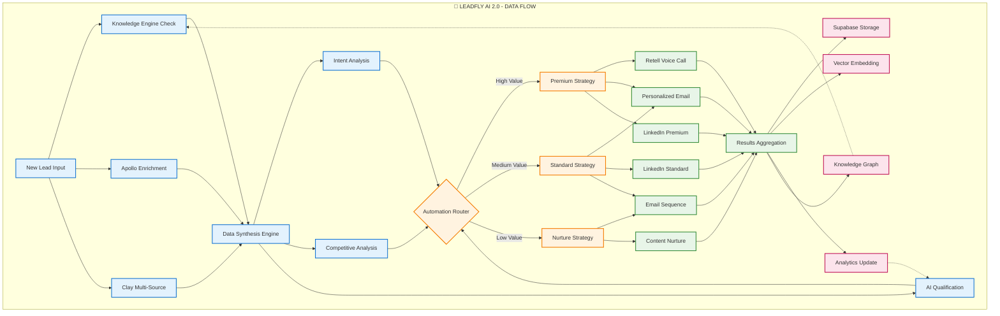
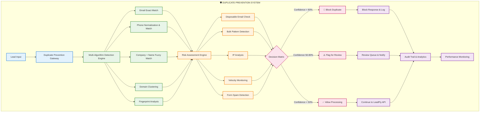
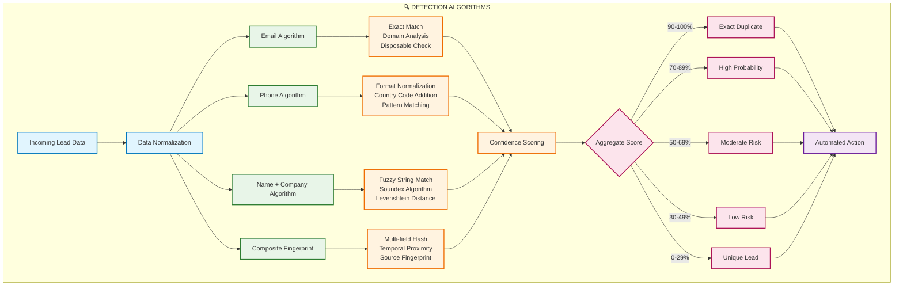
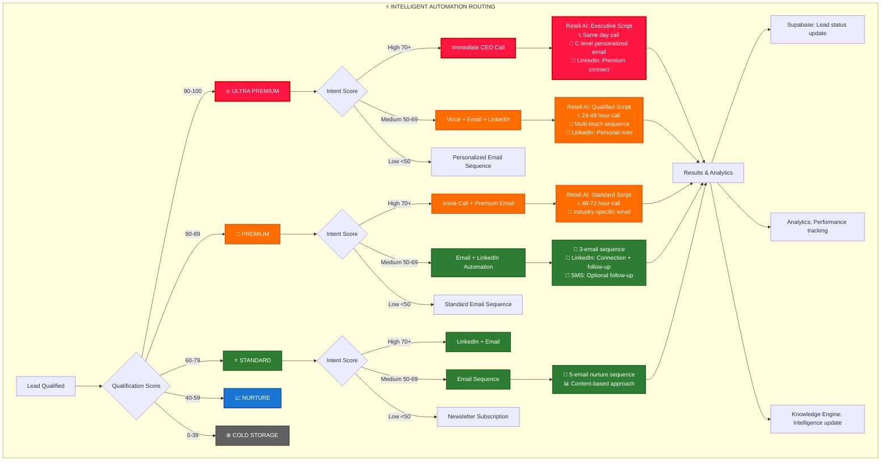
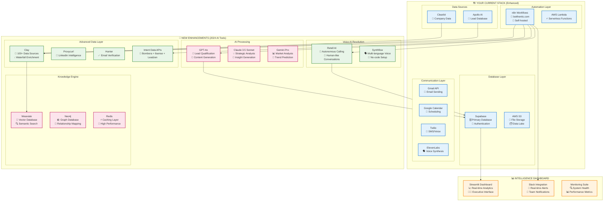
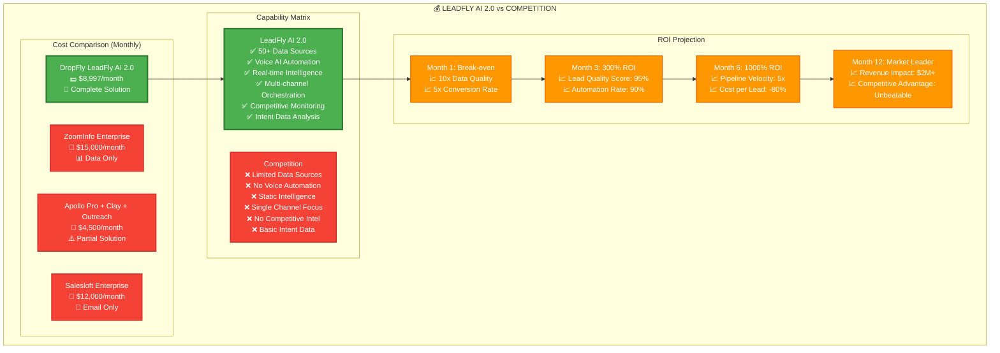

# LeadFly AI 2.0 - Complete System Architecture 🚀

## 🎯 **SYSTEM OVERVIEW MERMAID DIAGRAM**

```mermaid
graph TB
    %% INPUT LAYER
    subgraph "📥 DATA INPUT LAYER"
        A1[Lead Input Trigger]
        A2[Webhook Endpoints]
        A3[CSV/API Imports]
        A4[Form Submissions]
        A5[CRM Integrations]
        A6[Duplicate Prevention Gateway]
    end

    %% KNOWLEDGE ENGINE LAYER
    subgraph "🧠 DROPFLY KNOWLEDGE ENGINE"
        B1[Competitive Intelligence]
        B2[Market Research Scanner]
        B3[Technology Trend Analysis]
        B4[Intent Data Aggregation]
        B5[Real-time Threat Detection]
    end

    %% DATA ENRICHMENT LAYER
    subgraph "🔄 MULTI-SOURCE ENRICHMENT"
        C1[Apollo AI Enhanced]
        C2[Clay 100+ Sources]
        C3[Clearbit Company Data]
        C4[Proxycurl LinkedIn]
        C5[Hunter Email Verification]
        C6[UpLead Contact Verification]
    end

    %% INTENT ANALYSIS LAYER
    subgraph "🎯 INTENT INTELLIGENCE"
        D1[Bombora Intent Signals]
        D2[6sense Buying Signals]
        D3[Leadzen AI Analysis]
        D4[Website Visitor Tracking]
        D5[Social Media Monitoring]
    end

    %% AI PROCESSING LAYER
    subgraph "🤖 AI ANALYSIS ENGINE"
        E1[GPT-4o Lead Qualification]
        E2[Claude 3.5 Strategic Insights]
        E3[Gemini Pro Market Analysis]
        E4[Custom AI Scoring Models]
        E5[Sentiment Analysis]
        E6[Duplicate Detection AI]
    end

    %% AUTOMATION DECISION LAYER
    subgraph "⚡ AUTOMATION ROUTER"
        F1{Qualification Score > 80?}
        F2{Intent Score > 70?}
        F3[Premium Outreach Strategy]
        F4[Standard Outreach Strategy]
        F5[Nurture Strategy]
    end

    %% MULTI-CHANNEL EXECUTION LAYER
    subgraph "📞 VOICE AI AUTOMATION"
        G1[Retell AI Voice Calls]
        G2[Synthflow Conversations]
        G3[Real-time Qualification]
        G4[Calendar Booking]
        G5[Objection Handling]
    end

    subgraph "📧 EMAIL AUTOMATION"
        H1[AI Personalized Emails]
        H2[Gmail Integration]
        H3[Instantly.ai Sequences]
        H4[Follow-up Automation]
        H5[A/B Testing Engine]
    end

    subgraph "💼 LINKEDIN AUTOMATION"
        I1[Connection Requests]
        I2[Personalized Messages]
        I3[Profile Engagement]
        I4[Content Sharing]
        I5[Relationship Building]
    end

    subgraph "📱 MULTI-CHANNEL ORCHESTRATION"
        J1[SMS via Twilio]
        J2[WhatsApp Business]
        J3[Social Media Outreach]
        J4[Direct Mail Integration]
        J5[Event-based Triggers]
    end

    %% DATABASE LAYER
    subgraph "🗄️ UNIFIED DATABASE LAYER"
        K1[(Supabase Primary DB)]
        K2[(Weaviate Vector DB)]
        K3[(Neo4j Graph DB)]
        K4[(Redis Cache)]
        K5[(S3 Data Lake)]
    end

    %% INTELLIGENCE STORAGE
    subgraph "💎 KNOWLEDGE STORAGE"
        L1[Lead Intelligence Profiles]
        L2[Competitive Analysis Data]
        L3[Market Trend Insights]
        L4[Conversation Transcripts]
        L5[Performance Analytics]
    end

    %% MONITORING & ANALYTICS
    subgraph "📊 ANALYTICS & MONITORING"
        M1[Real-time Dashboard]
        M2[Executive Intelligence Brief]
        M3[Performance Metrics]
        M4[ROI Tracking]
        M5[Predictive Analytics]
    end

    %% INTEGRATION LAYER
    subgraph "🔗 EXTERNAL INTEGRATIONS"
        N1[Google Calendar]
        N2[Slack Notifications]
        N3[CRM Systems]
        N4[Marketing Platforms]
        N5[Analytics Tools]
    end

    %% CONNECTIONS
    A1 --> B1
    A1 --> C1
    B1 --> D1
    C1 --> E1
    D1 --> E1
    E1 --> F1
    F1 -->|Yes| F3
    F1 -->|No| F2
    F2 -->|Yes| F4
    F2 -->|No| F5

    F3 --> G1
    F3 --> H1
    F3 --> I1
    F4 --> H1
    F4 --> I1
    F5 --> H3

    G1 --> K1
    H1 --> K1
    I1 --> K1
    J1 --> K1

    K1 --> L1
    K2 --> L1
    K3 --> L1
    K4 --> L1
    K5 --> L1

    L1 --> M1
    M1 --> N1

    %% FEEDBACK LOOPS
    M1 -.-> E1
    M1 -.-> F1
    L1 -.-> B1

    %% STYLING
    classDef inputStyle fill:#e1f5fe,stroke:#01579b,stroke-width:2px
    classDef knowledgeStyle fill:#f3e5f5,stroke:#4a148c,stroke-width:2px
    classDef enrichmentStyle fill:#e8f5e8,stroke:#1b5e20,stroke-width:2px
    classDef intentStyle fill:#fff3e0,stroke:#e65100,stroke-width:2px
    classDef aiStyle fill:#fce4ec,stroke:#880e4f,stroke-width:2px
    classDef automationStyle fill:#e0f2f1,stroke:#004d40,stroke-width:2px
    classDef voiceStyle fill:#e8eaf6,stroke:#1a237e,stroke-width:2px
    classDef emailStyle fill:#f1f8e9,stroke:#33691e,stroke-width:2px
    classDef socialStyle fill:#e3f2fd,stroke:#0d47a1,stroke-width:2px
    classDef dbStyle fill:#fafafa,stroke:#212121,stroke-width:2px
    classDef analyticsStyle fill:#fff8e1,stroke:#ff6f00,stroke-width:2px

    class A1,A2,A3,A4,A5 inputStyle
    class B1,B2,B3,B4,B5 knowledgeStyle
    class C1,C2,C3,C4,C5,C6 enrichmentStyle
    class D1,D2,D3,D4,D5 intentStyle
    class E1,E2,E3,E4,E5 aiStyle
    class F1,F2,F3,F4,F5 automationStyle
    class G1,G2,G3,G4,G5 voiceStyle
    class H1,H2,H3,H4,H5 emailStyle
    class I1,I2,I3,I4,I5 socialStyle
    class K1,K2,K3,K4,K5,L1,L2,L3,L4,L5 dbStyle
    class M1,M2,M3,M4,M5 analyticsStyle
```

## 🔄 **DATA FLOW ARCHITECTURE**

## 🛡️ **DUPLICATE PREVENTION WORKFLOW ARCHITECTURE**

## 🔍 **DUPLICATE DETECTION ALGORITHMS**

## 🎯 **AUTOMATION DECISION MATRIX**

## 🛠️ **TECHNOLOGY STACK INTEGRATION**

## 💰 **ROI & COMPETITIVE ANALYSIS**

