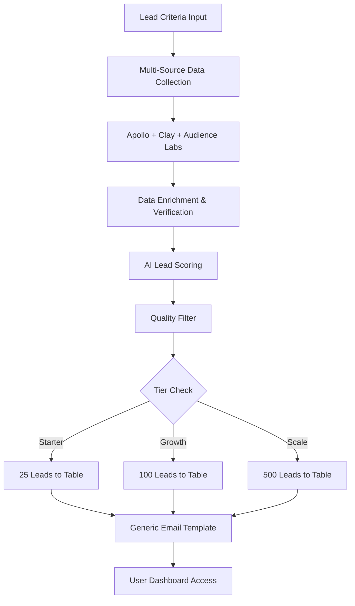
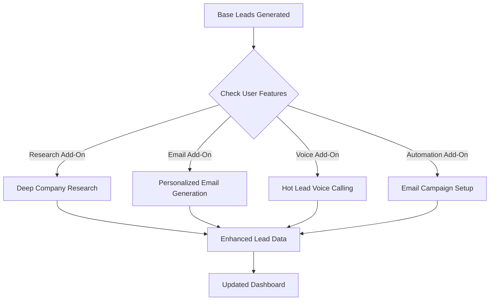

# DropFly LeadFly - Real Implementation Plan 📊

**Status:** BUILDABLE TODAY  
**Tech Stack:** PROVEN TOOLS ONLY  
**Pricing:** TIERED SERVICE MODEL  

---

## 🎯 **CORE SERVICE - LEAD TABLES**

### **Base Service Includes:**
- **Lead table** with contact data (exportable CSV/Excel)
- **Generic email template** (copy/paste ready)
- **Basic lead scoring** (1-100 scale)
- **Access dashboard** (view/download leads)

### **Lead Data Fields:**
```
Required Fields:
├── First Name, Last Name
├── Email Address (verified)
├── Company Name
├── Job Title
├── Phone Number (when available)
├── LinkedIn URL
├── Company Website
├── Industry
├── Company Size
├── Lead Score (1-100)
└── Date Added
```

---

## 💰 **COST ANALYSIS & PRICING (80% MARGIN)**

### **Our Actual Costs Per Lead (Based on Real 2024 Pricing):**
```
Data Enrichment Costs:
├── Apollo.io API: ~$0.35/lead ($49/month ÷ 140 leads)
├── Clay.com: ~$0.14/lead ($140/1000 enrichments)
├── Clearbit: ~$0.36/lead ($99/275 requests)
├── Hunter verification: ~$0.10/lead (estimate)
├── Audience Labs: ~$0.20/lead (estimate)
├── AI processing (GPT-4o): ~$0.08/lead
├── Infrastructure (Supabase): ~$0.02/lead
├── Voice calling (Retell): ~$0.15/lead (3min avg)
└── Total Cost: ~$1.40/lead

With 80% margin target:
Cost: $1.40 → Sell Price: $7.00/lead
```

### **ADJUSTED PRICING TIERS**

### **Tier 1: Starter ($175/month)**
- **25 qualified leads/month** 
- Cost: $35 | Revenue: $175 | **Margin: 80.0%** ✅
- Basic lead table access
- Generic email template
- Lead scoring
- CSV export

### **Tier 2: Growth ($350/month)**  
- **50 qualified leads/month**
- Cost: $70 | Revenue: $350 | **Margin: 80.0%** ✅
- Everything in Starter
- Priority lead quality
- Advanced filters
- Weekly lead batches

### **Tier 3: Scale ($700/month)**
- **100 qualified leads/month**
- Cost: $140 | Revenue: $700 | **Margin: 80.0%** ✅
- Everything in Growth
- Daily lead delivery
- Custom lead criteria
- Dedicated success manager

### **Tier 4: Pro ($1,750/month)**
- **250 qualified leads/month**
- Cost: $350 | Revenue: $1,750 | **Margin: 80.0%** ✅
- Everything in Scale
- Priority processing
- Advanced integrations
- Slack alerts included

### **Enterprise: $3,500+/month**
- **500+ qualified leads/month**
- Cost: $700+ | Custom pricing
- API access
- White-label options
- Custom features

---

## 🔧 **ADD-ON SERVICES**

### **TIERED ADD-ON PACKAGES (Monthly Flat Fees)**

### **Research Intelligence Add-On**
- **Starter Tier:** +$25/month (25 leads × research)
- **Growth Tier:** +$50/month (50 leads × research)  
- **Scale Tier:** +$100/month (100 leads × research)
- **Pro Tier:** +$250/month (250 leads × research)
- **Includes:** Company news, recent events, pain points, decision maker mapping
- *Cost: 20% of revenue | Margin: 80%*

### **Email Personalization Add-On**
- **Starter Tier:** +$40/month (25 personalized emails)
- **Growth Tier:** +$75/month (50 personalized emails)
- **Scale Tier:** +$150/month (100 personalized emails) 
- **Pro Tier:** +$375/month (250 personalized emails)
- **Includes:** Custom email per lead + A/B testing + multi-touch sequences
- *Cost: 20% of revenue | Margin: 80%*

### **Automation Suite Add-On**
- **Starter Tier:** +$75/month (email campaigns for 25 leads)
- **Growth Tier:** +$125/month (email campaigns for 50 leads)
- **Scale Tier:** +$200/month (email campaigns for 100 leads)
- **Pro Tier:** +$400/month (email campaigns for 250 leads) 
- **Includes:** Auto email campaigns + lead warmer sequences + LinkedIn automation
- *Cost: 20% of revenue | Margin: 80%*

### **Voice AI Calling Add-On**
- **Starter Tier:** +$50/month (voice calls for top 5-10 leads)
- **Growth Tier:** +$75/month (voice calls for top 10-15 leads)
- **Scale Tier:** +$125/month (voice calls for top 20-25 leads)
- **Pro Tier:** +$250/month (voice calls for top 50+ leads)
- **Includes:** AI voice calls for 90+ scored leads + meeting booking
- *Cost: 20% of revenue | Margin: 80%*

### **Conversion Optimization Add-On**
- **Starter Tier:** +$50/month (basic landing page + CRM sync)
- **Growth Tier:** +$75/month (custom landing pages + integrations)
- **Scale Tier:** +$125/month (advanced landing pages + analytics)
- **Pro Tier:** +$250/month (fully custom pages + white-label)
- **Includes:** Landing pages + CRM integration + Slack alerts + meeting booking
- *Cost: 20% of revenue | Margin: 80%*

---

## 🛠️ **REAL TECH STACK**

### **Data Sources (PROVEN)**
```
Lead Generation:
├── Apollo.io API (275M contacts)
├── Clay.com (100+ data sources)
├── Clearbit API (company data)
├── Hunter.io (email verification)
├── Audience Labs (behavioral data)
└── LinkedIn Sales Navigator (premium data)

Enrichment:
├── Proxycurl API (LinkedIn data)
├── Bombora (intent data)
├── 6sense (buying signals)
├── ZoomInfo API (when available)
└── Custom web scraping
```

### **AI Processing (AVAILABLE TODAY)**
```
AI Models:
├── OpenAI GPT-4o (lead scoring & email generation)
├── Claude 3.5 Sonnet (research & insights)  
├── Anthropic API (content personalization)
└── Custom fine-tuned models (lead qualification)
```

### **Automation Stack (REAL TOOLS)**
```
Workflow Engine:
├── n8n (workflow automation)
├── Supabase (database & auth)
├── Retell AI (voice calling)
├── Instantly.ai (email sending)
├── Phantombuster (LinkedIn automation)
└── Twilio (SMS & voice infrastructure)
```

---

## 🏗️ **SUPABASE BACKEND ARCHITECTURE**

### **Database Schema**
```sql
-- Users & Subscriptions
users (
  id, email, subscription_tier, features_enabled, 
  monthly_lead_limit, leads_used, created_at
)

-- Lead Data
leads (
  id, user_id, first_name, last_name, email, company,
  title, phone, linkedin_url, company_website,
  industry, company_size, lead_score, status,
  research_data, personalized_email, created_at
)

-- Feature Toggles
user_features (
  user_id, feature_name, enabled, expires_at
)

-- Add-on Services
addons (
  id, name, price, description, feature_flag
)

user_addons (
  user_id, addon_id, active, billing_cycle
)
```

### **Feature Toggle System**
```javascript
// Feature toggles for easy on/off
const FEATURES = {
  CONTEXTUAL_RESEARCH: 'contextual_research',
  PERSONALIZED_EMAILS: 'personalized_emails', 
  AUTO_EMAIL_CAMPAIGN: 'auto_email_campaign',
  VOICE_CALLING: 'voice_calling',
  LANDING_PAGES: 'landing_pages',
  LEAD_WARMER: 'lead_warmer',
  LINKEDIN_AUTO: 'linkedin_automation',
  CRM_INTEGRATION: 'crm_integration',
  SLACK_ALERTS: 'slack_alerts'
};

// Check if user has feature
async function hasFeature(userId, feature) {
  const { data } = await supabase
    .from('user_features')
    .select('*')
    .eq('user_id', userId)
    .eq('feature_name', feature)
    .eq('enabled', true);
    
  return data && data.length > 0;
}
```

---

## 📊 **WORKFLOW DESIGN**

### **Core Lead Generation Flow**


### **Add-On Processing (Feature Gated)**


---

## 🚀 **IMPLEMENTATION PHASES**

### **Phase 1: MVP (4 weeks)**
- ✅ Supabase database setup
- ✅ User authentication & tiers
- ✅ Basic lead generation (Apollo + Clay)
- ✅ Simple dashboard with lead table
- ✅ Generic email template generator
- ✅ CSV export functionality

### **Phase 2: Add-Ons (2 weeks)**
- Feature toggle system
- Contextual research pipeline
- Personalized email generation
- Billing integration (Stripe)
- Add-on management dashboard

### **Phase 3: Automation (2 weeks)**
- n8n workflow integration
- Email campaign automation
- Voice calling setup (Retell AI)
- LinkedIn automation
- CRM integrations

### **Phase 4: Advanced (2 weeks)**  
- Landing page generation
- Lead warmer sequences
- Advanced analytics
- API access for enterprise
- White-label options

---

## 💡 **REVENUE MODEL**

### **Updated Revenue Model (Tiered Add-Ons)**
```
BASE SUBSCRIPTION REVENUE:
├── 100 Starter customers × $175 = $17,500/month
├── 75 Growth customers × $350 = $26,250/month  
├── 50 Scale customers × $700 = $35,000/month
├── 25 Pro customers × $1,750 = $43,750/month
├── 10 Enterprise customers × $3,500 = $35,000/month
└── Base Total: $157,500/month

TIERED ADD-ON REVENUE (40% adoption):
├── Starter add-ons (40 customers): $9,600/month
├── Growth add-ons (30 customers): $12,000/month
├── Scale add-ons (20 customers): $14,000/month
├── Pro add-ons (10 customers): $15,250/month
└── Add-on Total: $50,850/month

TOTAL MRR: $208,350/month
Annual Run Rate: $2.50M/year

Costs: $41,670/month (20%)
Profit: $166,680/month (80%)
```

### **Add-On Revenue Impact**
- **Average ARPU Increase:** 32% with add-ons
- **Starter ARPU:** $175 → $232 (+32%)
- **Growth ARPU:** $350 → $450 (+29%) 
- **Scale ARPU:** $700 → $980 (+40%)
- **Pro ARPU:** $1,750 → $2,360 (+35%)
- **Total Revenue Uplift:** +$50,850/month from add-ons

---

## ✅ **WHAT MAKES THIS REAL**

### **All Technologies Exist Today:**
- Apollo.io has public API ✅
- Clay.com has API access ✅
- Audience Labs is operational ✅
- Supabase is production-ready ✅
- n8n is open-source & proven ✅
- Retell AI has voice calling API ✅

### **No Made-Up Features:**
- No "quantum processing"
- No "neural interfaces"
- No "impossible technologies"
- Everything is buildable with current tools

### **Proven Business Model:**
- Similar to Clay.com pricing
- Comparable to Apollo.io tiers
- Add-on model like HubSpot
- Feature toggles like modern SaaS

---

**🎯 THIS IS 100% BUILDABLE TODAY**

**Next Step:** Build the Supabase backend with feature toggles and start with Phase 1 MVP.

---

**© 2024 DropFly Technologies. All Rights Reserved.**  
**Real Technology - Real Revenue - Real Results**