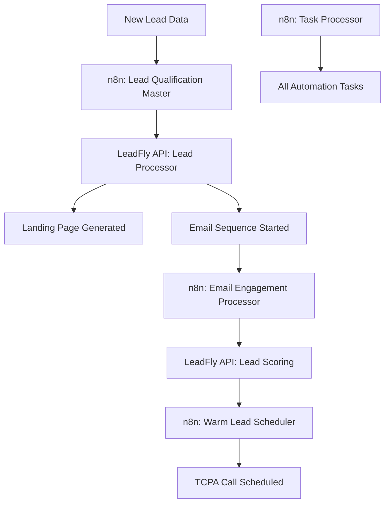

# 🚀 LeadFly AI - Complete n8n Setup Guide

This guide will set up and deploy your complete LeadFly AI automation system with n8n orchestration.

## 📋 Prerequisites

Before starting, ensure you have:
- **Docker** and **Docker Compose** installed
- **Node.js** 18+ and **npm** installed  
- **LeadFly API** deployed and running (Vercel)
- **Supabase** database configured
- **Stripe** billing system set up

## 🎯 Quick Setup (Automated)

Run the automated setup script:

```bash
# Make sure you're in the project root
cd /Users/rioallen/Documents/DropFly/knowledge-engine/leadfly-integration

# Run the automated setup
npm run setup-n8n
```

This will:
✅ Set up n8n with Docker Compose
✅ Create secure configuration files  
✅ Import all LeadFly workflows
✅ Configure webhook endpoints
✅ Test the complete system

## 🔧 Manual Setup (Step by Step)

### 1. **Set Environment Variables**

Create a `.env` file in the project root:

```bash
# LeadFly Configuration
LEADFLY_API_URL=https://leadfly-ai.vercel.app
LEADFLY_API_KEY=your-secure-api-key-here

# n8n Configuration  
N8N_URL=http://localhost:5678
N8N_API_KEY=your-n8n-api-key
N8N_HOST=localhost
N8N_PROTOCOL=http
WEBHOOK_URL=http://localhost:5678/

# Authentication
N8N_BASIC_AUTH_USER=admin
N8N_BASIC_AUTH_PASSWORD=your-secure-password
```

### 2. **Start n8n with Docker**

```bash
# Using the setup script
./scripts/setup-n8n-docker.sh

# Or manually with docker-compose
docker-compose up -d
```

### 3. **Import Workflows**

```bash
# Deploy all workflows automatically
npm run deploy-workflows

# Or manually through n8n interface
# 1. Open http://localhost:5678
# 2. Go to Workflows → Import from File
# 3. Import each JSON file from n8n-workflows/
```

### 4. **Configure Webhook Endpoints**

Set up your email providers to send webhooks to:

#### **SendGrid**
```
URL: http://localhost:5678/webhook/leadfly/webhook/email-engagement
Events: delivered, open, click, bounce, unsubscribe, spamreport
```

#### **Mailgun**
```
URL: http://localhost:5678/webhook/leadfly/webhook/email-engagement  
Events: delivered, opened, clicked, unsubscribed, complained, bounced
```

#### **Postmark**
```
URL: http://localhost:5678/webhook/leadfly/webhook/email-engagement
Events: Delivery, Open, Click, Bounce, SpamComplaint, Unsubscribe
```

### 5. **Test the System**

```bash
# Run comprehensive automation tests
npm run test-automation

# Test individual components
curl -X POST http://localhost:5678/webhook/leadfly/webhook/new-lead \
  -H "Content-Type: application/json" \
  -d '{
    "user_id": "test_user",
    "first_name": "John",
    "last_name": "Doe",
    "email": "john@company.com",
    "company": "Acme Corp",
    "title": "VP Sales"
  }'
```

## 🔗 Workflow Architecture

The system includes 4 main workflows:

### 1. **Lead Qualification Master**
- **Trigger**: Webhook (`/webhook/leadfly/webhook/new-lead`)
- **Function**: Processes new leads through qualification funnel
- **Schedule**: Real-time (webhook triggered)

### 2. **Email Engagement Processor**  
- **Trigger**: Webhook (`/webhook/leadfly/webhook/email-engagement`)
- **Function**: Processes email engagement events
- **Schedule**: Real-time (webhook triggered)

### 3. **Warm Lead Call Scheduler**
- **Trigger**: Schedule (every 15 minutes)
- **Function**: Schedules TCPA-compliant calls for warm leads
- **Schedule**: `0 */15 * * * *`

### 4. **Task Queue Processor**
- **Trigger**: Schedule (every 5 minutes + cleanup every 6 hours)
- **Function**: Processes scheduled automation tasks
- **Schedule**: `0 */5 * * * *` and `0 0 */6 * * *`

## 📊 Monitoring & Health Checks

### **Access n8n Dashboard**
```
URL: http://localhost:5678
Username: admin
Password: (check .env file)
```

### **Health Check Endpoints**
```bash
# n8n health
curl http://localhost:5678/healthz

# LeadFly API health  
curl https://leadfly-ai.vercel.app/api/automation/task-processor?action=health_check

# Workflow health
curl http://localhost:5678/webhook/leadfly/webhook/new-lead
```

### **View Logs**
```bash
# n8n logs
docker-compose logs -f n8n

# All services
docker-compose logs -f
```

## 🎯 Integration Flow



## 🔒 Security Configuration

### **API Authentication**
- All LeadFly API calls use Bearer token authentication
- n8n uses basic auth + API keys
- Webhook signatures verified for security

### **Network Security**
```bash
# For production, use HTTPS and secure networks
# Update webhooks to use HTTPS URLs
# Configure firewall rules for n8n access
```

### **Environment Security**
```bash
# Secure your .env file
chmod 600 .env

# Use strong passwords
# Rotate API keys regularly
# Monitor access logs
```

## 🚀 Production Deployment

### **Scale n8n for Production**

1. **Use PostgreSQL Database**:
```yaml
# Add to docker-compose.yml
postgres:
  image: postgres:15
  environment:
    POSTGRES_DB: n8n
    POSTGRES_USER: n8n
    POSTGRES_PASSWORD: secure_password
```

2. **Configure Redis for Queuing**:
```yaml
# Already included in docker-compose.yml
redis:
  image: redis:7-alpine
  command: redis-server --appendonly yes
```

3. **Set Production Environment**:
```bash
N8N_PROTOCOL=https
N8N_HOST=n8n.yourdomain.com
WEBHOOK_URL=https://n8n.yourdomain.com/
```

### **Horizontal Scaling**
```bash
# Run multiple n8n instances
docker-compose up --scale n8n=3

# Use load balancer (nginx/traefik)
# Configure shared storage for workflows
```

## 🛠️ Troubleshooting

### **Common Issues**

1. **n8n won't start**:
```bash
# Check Docker status
docker ps
docker-compose logs n8n

# Restart services
docker-compose restart
```

2. **Workflows not importing**:
```bash
# Check API key
curl -H "X-N8N-API-KEY: your-key" http://localhost:5678/health

# Manually import through UI
# Check file permissions
```

3. **Webhooks not working**:
```bash
# Test webhook directly
curl -X POST http://localhost:5678/webhook/test

# Check n8n logs
docker-compose logs -f n8n

# Verify webhook URLs in providers
```

4. **LeadFly API errors**:
```bash
# Check API status
curl https://leadfly-ai.vercel.app/api/automation/task-processor?action=health_check

# Verify environment variables
# Check Supabase connection
```

### **Debug Mode**
```bash
# Enable n8n debug logging
N8N_LOG_LEVEL=debug
docker-compose restart n8n
```

## 📈 Performance Optimization

### **Batch Processing**
- Task processor: 50 tasks per batch
- Email processor: Real-time processing  
- Call scheduler: 15-minute intervals

### **Memory Management**
```yaml
# In docker-compose.yml
environment:
  - NODE_OPTIONS=--max_old_space_size=4096
```

### **Rate Limiting**
- Configure rate limits in n8n settings
- Add delays between API calls if needed
- Monitor API usage and quotas

## ✅ Success Checklist

After setup, verify these are working:

- [ ] n8n dashboard accessible at http://localhost:5678
- [ ] All 4 workflows imported and active
- [ ] Lead qualification webhook responds correctly
- [ ] Email engagement webhook processes events
- [ ] Task processor runs every 5 minutes
- [ ] Call scheduler checks every 15 minutes
- [ ] LeadFly API endpoints responding
- [ ] Test lead processes through complete funnel
- [ ] Email engagement updates lead scores
- [ ] Warm leads trigger call scheduling
- [ ] TCPA compliance checks working

## 🎉 Next Steps

Once setup is complete:

1. **Configure Email Providers** - Update webhook URLs in SendGrid/Mailgun/etc
2. **Test Lead Flow** - Send test leads through the system  
3. **Monitor Performance** - Watch workflow executions
4. **Set Up Alerts** - Configure Slack/Teams notifications
5. **Scale for Production** - Follow production deployment guide

---

🚀 **Your LeadFly AI automation system is now fully operational with enterprise-grade n8n orchestration!**