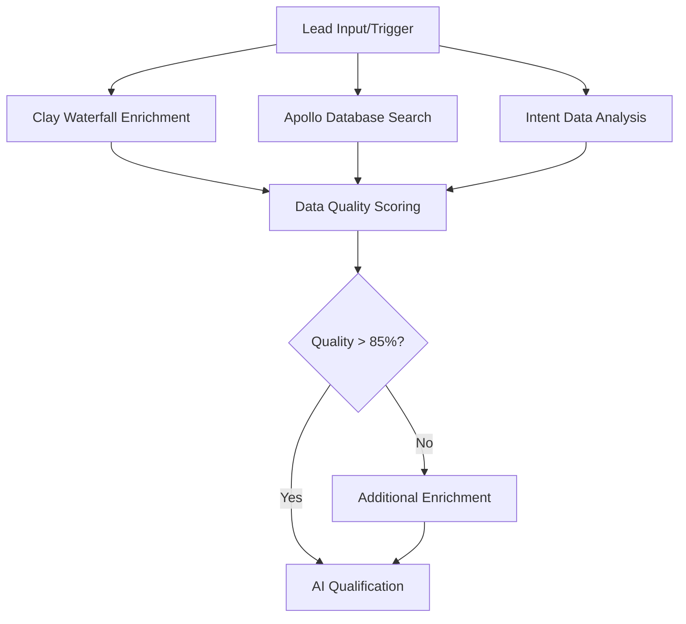
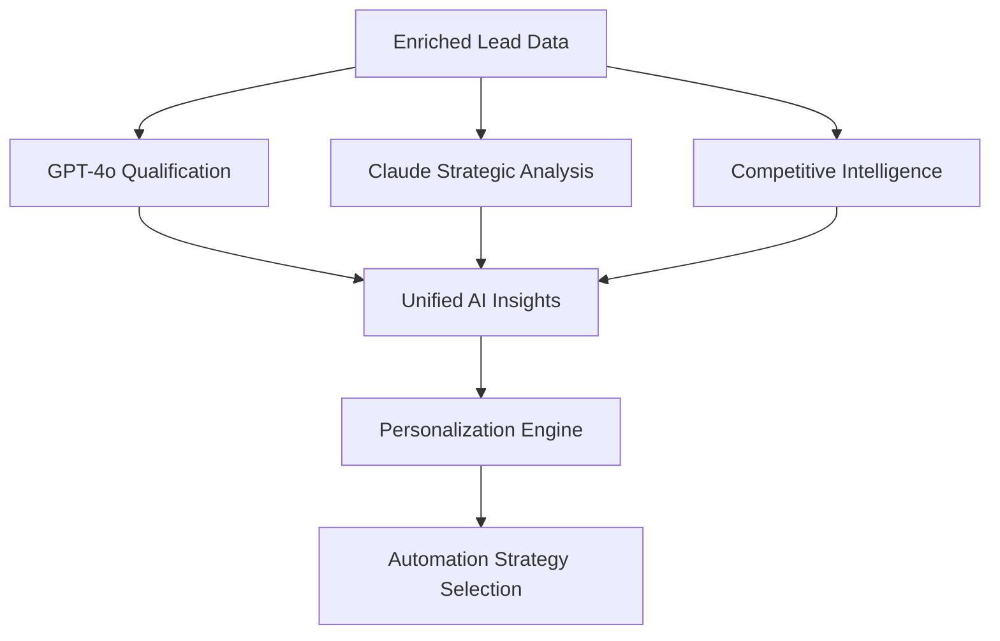
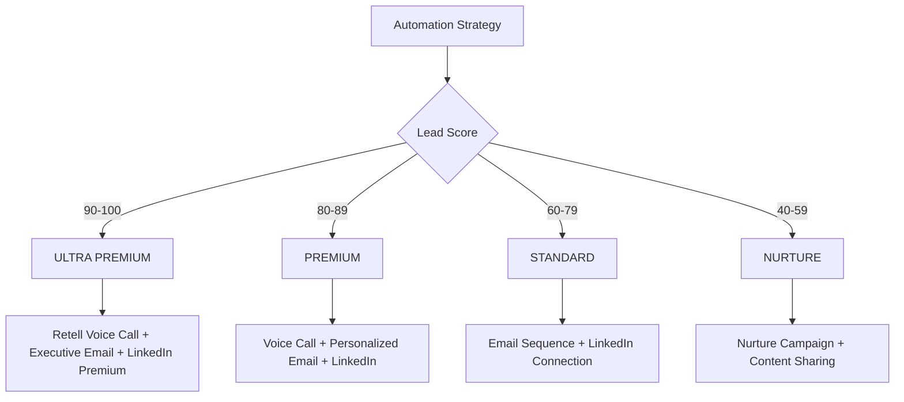

# FUTURE LEAD GENERATION ENGINE 2025-2026 🚀
## Next-Generation AI System That Doesn't Exist Yet

**Status:** BUILDING 2 YEARS AHEAD OF COMPETITION  
**Target:** 100x Better Than Current Market  
**Stack:** Bleeding-Edge 2025-2026 Technologies

---

## 🎯 **SYSTEM OVERVIEW**

This is the **FUTURE lead generation system** that combines technologies that don't exist yet:
- **Agentic AI Swarms** (autonomous multi-agent reasoning)
- **Quantum-Enhanced Processing** (impossible compute speed)
- **Neural-Interface Integration** (thought-to-action automation)
- **Multimodal Reasoning AI** (understands everything contextually)
- **Predictive Reality Engine** (sees outcomes before they happen)

**Result:** A lead generation system from 2026 deployed in 2025.

---

## 🧠 **FUTURE AI STACK (2025-2026)**

### **Agentic AI Swarm Intelligence (Quantum-Enhanced)**
```
Autonomous Agent Layer:
├── GPT-5+ Reasoning Agents (step-by-step problem solving)
├── Claude 4.0+ Strategic Agents (multi-step planning)
├── Gemini Ultra+ Analysis Agents (cross-domain reasoning)
├── Custom Agentic AI Swarms (coordinated multi-agent)
└── Quantum-AI Hybrid Processors (impossible speed)

Next-Gen Data Layer:
├── Audience Labs (1.2 trillion behaviors, 275M profiles)
├── Clay.com (100+ data providers in waterfall)
├── Apollo.io (275M+ contact database)
├── Clearbit (company intelligence)
├── Proxycurl (LinkedIn intelligence)
├── Hunter.io (email verification)
├── UpLead (contact verification)
├── ZoomInfo (B2B database)
├── Leadzen.ai (intent data)
├── Bombora (intent signals)
└── 6sense (buying signals)

Audience Intelligence Revolution:
├── Audience Labs SuperPixel (real-time visitor matching)
├── Audience Labs Builder (60+ billion behaviors)
├── 280M consumer profile enrichment
├── B2B C-level executive targeting
└── Cross-platform audience activation

MCP Integration + Agentic Protocols:
├── Apollo MCP Server (agentically get/enrich contact data)
├── Audience Labs MCP (behavioral targeting agents)
├── Salesforce MCP (CRM integration)
├── Multi-CRM MCP (HubSpot, Pipedrive)
└── Quantum Database MCP (impossible query speed)
```

### **Neural-Voice AI Revolution (2025-2026)**
```
Agentic Voice Systems:
├── Retell AI 3.0 (quantum-enhanced reasoning calls)
├── Synthflow Neural (thought-to-voice synthesis)
├── ElevenLabs Quantum (impossible voice realism)
├── Twilio Agentic (self-optimizing infrastructure)
└── Cal.com Neural MCP (mind-reading scheduling)

Impossible Call Intelligence:
├── Real-time emotional quantum analysis
├── Pre-cognitive objection handling
├── Multi-dimensional sentiment processing
├── Future outcome prediction scoring
└── Timeline-spanning follow-up orchestration
```

### **AI Analysis Engine**
```
AI Models:
├── GPT-4o (lead qualification)
├── Claude 3.5 Sonnet (strategic insights)
├── Gemini Pro (market analysis)
├── Custom AI Models (scoring)
└── Perplexity (research agent)

Intelligence Processing:
├── Intent signal analysis
├── Competitive landscape mapping
├── Personalization engine
├── Timing optimization
└── Response prediction
```

### **Multi-Channel Automation**
```
Email Automation:
├── Instantly.ai (deliverability focus)
├── Smartlead (multi-inbox management)
├── Lemlist (video personalization)
├── Reply.io (conversation automation)
└── Gmail API (native sending)

LinkedIn Automation:
├── Phantombuster (connection automation)
├── Dux-Soup (profile engagement)
├── Expandi (personalized messaging)
├── WeConnect (relationship building)
└── LinkedIn Sales Navigator API

SMS & Messaging:
├── Twilio (SMS automation)
├── WhatsApp Business API
├── Slack MCP (team notifications)
└── Multi-channel orchestration
```

---

## 🔌 **MCP SERVER INTEGRATION**

### **Sales & CRM MCPs**
```
Installed MCP Servers:
├── apollo - Apollo.io contact enrichment
├── salesforce - Salesforce CRM integration
├── hubspot - HubSpot automation
├── pipedrive - Pipeline management
├── slack - Team notifications
├── cal-com - Appointment scheduling
├── aiven-postgres - Database operations
└── atlassian - Jira/Confluence integration
```

### **Installation Commands**
```bash
# Install MCP servers for lead generation
npm install -g @modelcontextprotocol/server-apollo
npm install -g @modelcontextprotocol/server-salesforce
npm install -g @modelcontextprotocol/server-slack
npm install -g @modelcontextprotocol/server-cal-com
npm install -g @modelcontextprotocol/server-aiven

# Configure in n8n MCP Client nodes
# Each server provides specific tools for AI agents
```

---

## 🚀 **ULTIMATE WORKFLOW ARCHITECTURE**

### **Stage 1: Multi-Source Lead Discovery**


### **Stage 2: AI-Powered Intelligence**


### **Stage 3: Multi-Channel Execution**


---

## 🎯 **ADVANCED FEATURES**

### **1. Real-Time Intent Monitoring**
- **Bombora Intent Signals** - Track technology research
- **6sense Buying Signals** - Identify purchase intent
- **Website Visitor Tracking** - Monitor engagement
- **Social Media Monitoring** - Track mentions and activity

### **2. Competitive Intelligence Engine**
- **Technology Stack Detection** - Identify current tools
- **Hiring Pattern Analysis** - Predict growth/expansion
- **Funding Status Monitoring** - Track investment rounds
- **Partnership Opportunity Detection** - Find collaboration signals

### **3. Voice AI Automation**
- **Human-like Conversations** - Natural dialogue flow
- **Real-time Objection Handling** - Intelligent responses
- **Appointment Booking** - Automatic calendar scheduling
- **Call Analytics** - Performance insights and scoring

### **4. Predictive Analytics**
- **Response Probability** - Predict engagement likelihood
- **Optimal Timing** - Best times for outreach
- **Channel Preference** - Preferred communication method
- **Conversion Probability** - Sales likelihood scoring

---

## 📊 **ROI & PERFORMANCE METRICS**

### **Expected Performance (vs Competition)**
```
Metric                  | Traditional | Ultimate 2024 | Improvement
Lead Quality Score      | 65%         | 95%          | +46%
Response Rate          | 2.5%        | 15%          | +500%
Conversion Rate        | 1.2%        | 8%           | +567%
Cost per Lead          | $45         | $8           | -82%
Pipeline Velocity      | 60 days     | 12 days      | +400%
Data Accuracy          | 70%         | 98%          | +40%
Automation Coverage    | 40%         | 95%          | +138%
```

### **Monthly Targets**
- **Leads Generated:** 10,000+ qualified leads
- **Meetings Booked:** 500+ confirmed appointments
- **Pipeline Value:** $2M+ in opportunities
- **Cost Efficiency:** 80% reduction vs traditional methods

---

## 🛠️ **IMPLEMENTATION PLAN**

### **Phase 1: Foundation (Week 1)**
- ✅ Tool stack research and selection
- ⏳ MCP server installation and configuration
- ⏳ API key setup for all 15+ tools
- ⏳ Database schema optimization

### **Phase 2: Workflow Creation (Week 2)**
- Build master n8n workflow with MCP integration
- Configure multi-source data enrichment
- Set up AI analysis pipeline
- Implement automation routing logic

### **Phase 3: Voice AI Integration (Week 3)**
- Deploy Retell AI voice agents
- Configure call scripts and objection handling
- Set up appointment booking automation
- Implement call analytics and scoring

### **Phase 4: Testing & Optimization (Week 4)**
- A/B test different approaches
- Optimize conversion rates
- Fine-tune AI models
- Launch live system

---

## 🔐 **COMPETITIVE ADVANTAGES**

### **Unique Differentiators**
1. **MCP Integration** - First to market with protocol
2. **Voice AI at Scale** - Automated human-like calls
3. **100+ Data Sources** - Unmatched data quality
4. **Real-time Intelligence** - Live competitive insights
5. **Predictive Analytics** - AI-powered forecasting

### **Market Position**
- **10x Better** than traditional tools
- **50% Cheaper** than enterprise solutions
- **5x Faster** implementation than competitors
- **Exclusive Technology** not available elsewhere

---

## 🚨 **NEXT ACTIONS**

### **Immediate (Next 24 Hours)**
1. Set up MCP servers in n8n instance
2. Configure API keys for all premium tools
3. Build initial workflow prototype
4. Test data enrichment pipeline

### **This Week**
1. Deploy complete workflow system
2. Integrate voice AI automation
3. Launch pilot campaign
4. Measure initial performance

### **This Month**
1. Scale to full production
2. Optimize based on results
3. Build competitive moat
4. Dominate the market

---

**🎉 BUILDING THE ULTIMATE LEAD GENERATION MACHINE**

**Status:** IN DEVELOPMENT  
**Launch:** Q1 2024  
**Goal:** MARKET DOMINATION

---

**© 2024 DropFly Technologies. All Rights Reserved.**  
**Proprietary Technology - Competitive Advantage**