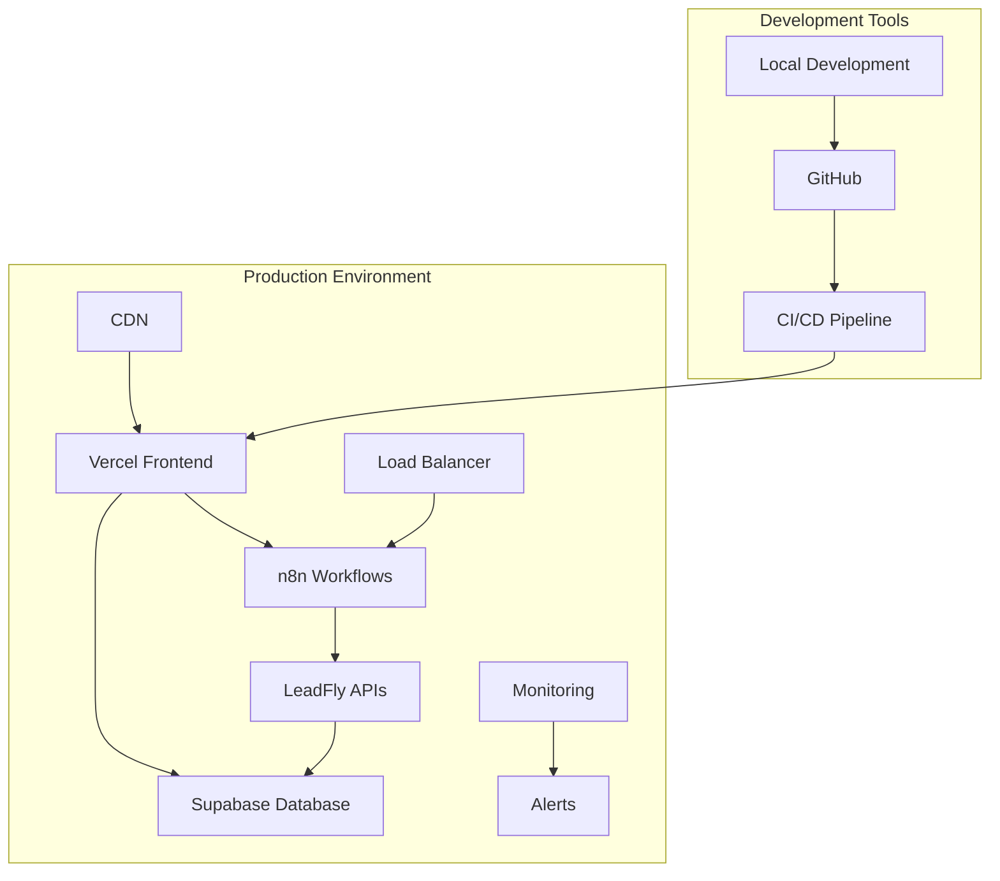

# 🚀 Complete Deployment Guide - LeadFly AI

This comprehensive guide covers deploying LeadFly AI from development to production, including all components, configurations, and best practices.

## 📋 Deployment Overview

### **Deployment Architecture**


### **Deployment Stages**
1. **Development** - Local development and testing
2. **Staging** - Pre-production testing environment  
3. **Production** - Live production environment
4. **Monitoring** - Ongoing monitoring and maintenance

## 🔧 Prerequisites

### **Required Accounts & Services**
- [x] **GitHub Account** - Code repository and CI/CD
- [x] **Vercel Account** - Frontend hosting and APIs
- [x] **Supabase Account** - Database and authentication
- [x] **Docker Hub** - Container registry (optional)
- [x] **Stripe Account** - Payment processing (optional)

### **Required Tools**
```bash
# Install required tools
node --version     # v18.0.0 or higher
npm --version      # v8.0.0 or higher
docker --version   # v20.0.0 or higher
git --version      # v2.30.0 or higher

# Install Vercel CLI
npm install -g vercel

# Install Supabase CLI (optional)
npm install -g supabase
```

### **Environment Variables**
Create these environment files:

**`.env.local` (Development)**
```bash
# Database Configuration
NEXT_PUBLIC_SUPABASE_URL="https://your-project.supabase.co"
SUPABASE_SERVICE_ROLE_KEY="your-service-role-key"
SUPABASE_ANON_KEY="your-anon-key"

# API Configuration
NEXT_PUBLIC_API_URL="http://localhost:3000"
LEADFLY_API_URL="http://localhost:3000"

# n8n Configuration  
N8N_BASE_URL="http://localhost:5678"
N8N_API_KEY="your-n8n-api-key"
N8N_WEBHOOK_URL="http://localhost:5678/webhook/leadfly/duplicate-prevention"

# Authentication (optional)
NEXTAUTH_SECRET="your-nextauth-secret"
NEXTAUTH_URL="http://localhost:3000"

# Payment Processing (optional)
STRIPE_SECRET_KEY="sk_test_your-stripe-key"
STRIPE_WEBHOOK_SECRET="whsec_your-webhook-secret"
NEXT_PUBLIC_STRIPE_PUBLISHABLE_KEY="pk_test_your-stripe-key"

# AI Services (optional)
OPENAI_API_KEY="your-openai-key"
ANTHROPIC_API_KEY="your-anthropic-key"
```

**`.env.production` (Production)**
```bash
# Production Database
NEXT_PUBLIC_SUPABASE_URL="https://your-prod-project.supabase.co"
SUPABASE_SERVICE_ROLE_KEY="your-prod-service-role-key"

# Production APIs
NEXT_PUBLIC_API_URL="https://your-app.vercel.app"
LEADFLY_API_URL="https://your-app.vercel.app"

# Production n8n
N8N_BASE_URL="https://your-n8n-domain.com"
N8N_API_KEY="your-prod-n8n-api-key"
N8N_WEBHOOK_URL="https://your-n8n-domain.com/webhook/leadfly/duplicate-prevention"

# Production Stripe
STRIPE_SECRET_KEY="sk_live_your-live-stripe-key"
STRIPE_WEBHOOK_SECRET="whsec_your-live-webhook-secret"
NEXT_PUBLIC_STRIPE_PUBLISHABLE_KEY="pk_live_your-live-stripe-key"
```

## 📊 Step 1: Database Setup

### **Supabase Project Creation**
```bash
# Create new Supabase project
# 1. Go to https://supabase.com/dashboard
# 2. Click "New Project"
# 3. Choose organization and region
# 4. Set project name: "leadfly-ai-prod"
# 5. Set database password (save securely)
# 6. Wait for project creation (~2 minutes)
```

### **Database Schema Deployment**
```bash
# Option 1: Using Supabase Dashboard
# 1. Go to SQL Editor in your Supabase project
# 2. Copy contents of supabase-schema.sql
# 3. Paste and run the SQL

# Option 2: Using automated script
cd /path/to/leadfly-integration
npm run setup-database

# Option 3: Using Supabase CLI
supabase db push --project-ref your-project-ref
```

### **Database Verification**
```bash
# Test database connection
npm run test-db-connection

# Verify tables created
npm run verify-schema

# Add test data (optional)
npm run seed-test-data
```

## 🏗️ Step 2: n8n Workflow Setup

### **n8n Instance Deployment**

#### **Option A: Docker Compose (Recommended)**
```bash
# Start n8n with Docker
cd /path/to/leadfly-integration
docker-compose up -d

# Verify n8n is running
curl http://localhost:5678/rest/settings
```

#### **Option B: Cloud n8n**
```bash
# Use n8n Cloud for production
# 1. Sign up at https://n8n.cloud
# 2. Create new instance
# 3. Get API credentials
# 4. Update N8N_BASE_URL in environment
```

### **Workflow Deployment**
```bash
# Create n8n API key
# 1. Open http://localhost:5678 (or your n8n cloud URL)
# 2. Go to Settings > API Keys  
# 3. Create key with "Workflow: Read, Write, Execute" permissions
# 4. Copy key and set: export N8N_API_KEY="your-key"

# Deploy all workflows
npm run deploy-workflows

# Deploy specific workflow
node scripts/deploy-duplicate-prevention.js

# Verify workflows are active
npm run verify-workflows
```

### **Workflow Testing**
```bash
# Test duplicate prevention workflow
npm run test-duplicate-prevention

# Test all n8n integrations
npm run test-n8n-workflows

# Monitor workflow execution
docker logs leadfly-n8n
```

## 🚢 Step 3: Frontend & API Deployment

### **Vercel Project Setup**
```bash
# Install Vercel CLI
npm install -g vercel

# Login to Vercel
vercel login

# Initialize project
vercel

# Follow prompts:
# ? Set up and deploy "leadfly-integration"? Y
# ? Which scope? (your-team)
# ? Link to existing project? N
# ? What's your project's name? leadfly-ai
# ? In which directory is your code located? ./
```

### **Environment Variables Configuration**
```bash
# Add production environment variables
vercel env add NEXT_PUBLIC_SUPABASE_URL
vercel env add SUPABASE_SERVICE_ROLE_KEY
vercel env add N8N_BASE_URL
vercel env add N8N_API_KEY
vercel env add STRIPE_SECRET_KEY
vercel env add STRIPE_WEBHOOK_SECRET

# Or use automated script
npm run setup-vercel-env
```

### **Production Deployment**
```bash
# Deploy to production
vercel --prod

# Or use automated deployment
npm run deploy-production

# Verify deployment
curl https://your-app.vercel.app/api/health
```

### **Custom Domain Setup (Optional)**
```bash
# Add custom domain in Vercel dashboard
# 1. Go to your project in Vercel dashboard
# 2. Click "Domains" tab
# 3. Add your domain (e.g., app.leadfly.ai)
# 4. Configure DNS records as shown
# 5. Wait for SSL certificate provisioning

# Update environment variables with new domain
vercel env add NEXT_PUBLIC_API_URL production
# Enter: https://app.leadfly.ai
```

## ⚙️ Step 4: Integration Configuration

### **Stripe Integration (Optional)**
```bash
# Set up Stripe webhooks
# 1. Go to Stripe Dashboard > Webhooks
# 2. Click "Add endpoint"
# 3. URL: https://your-app.vercel.app/api/stripe/webhook
# 4. Events: customer.subscription.created, customer.subscription.updated, invoice.payment_succeeded
# 5. Copy webhook secret to environment variables

# Test Stripe integration
npm run test-stripe-integration
```

### **n8n Webhook Configuration**
```bash
# Update n8n webhook URLs for production
# 1. Open n8n interface
# 2. Go to each workflow
# 3. Update webhook URLs to production domain
# 4. Save and activate workflows

# Or use automated script
npm run update-webhook-urls --env=production
```

### **API Endpoints Verification**
```bash
# Test all API endpoints
npm run test-api-endpoints

# Health checks
curl https://your-app.vercel.app/api/health
curl https://your-app.vercel.app/api/analytics?userId=test
curl https://your-n8n-domain.com/webhook/leadfly/duplicate-prevention

# Performance tests
npm run test-performance
```

## 🔒 Step 5: Security Configuration

### **Supabase Security**
```sql
-- Enable Row Level Security (RLS)
ALTER TABLE leads ENABLE ROW LEVEL SECURITY;
ALTER TABLE user_subscriptions ENABLE ROW LEVEL SECURITY;
ALTER TABLE landing_pages ENABLE ROW LEVEL SECURITY;

-- Create security policies
CREATE POLICY "Users can only see their own leads" ON leads
  FOR ALL USING (auth.uid() = user_id);

CREATE POLICY "Users can only see their own subscriptions" ON user_subscriptions
  FOR ALL USING (auth.uid() = user_id);
```

### **API Security**
```javascript
// Rate limiting configuration
const rateLimitConfig = {
  interval: 60 * 1000, // 1 minute
  uniqueTokenPerInterval: 500, // limit per IP
  tokensPerInterval: 10 // requests per minute
}

// CORS configuration
const corsConfig = {
  origin: [
    'https://your-app.vercel.app',
    'https://app.leadfly.ai'
  ],
  credentials: true,
  optionsSuccessStatus: 200
}
```

### **Environment Security**
```bash
# Secure environment variables
# 1. Use Vercel's encrypted environment variables
# 2. Rotate API keys regularly
# 3. Use separate keys for staging/production
# 4. Enable 2FA on all accounts

# Security verification
npm run security-audit
npm audit --audit-level moderate
```

## 📊 Step 6: Monitoring & Alerting

### **Vercel Analytics**
```bash
# Enable Vercel Analytics
# 1. Go to project settings in Vercel dashboard
# 2. Enable "Analytics" 
# 3. Enable "Speed Insights"
# 4. Configure custom events

# Add monitoring code
// In your Next.js app
import { Analytics } from '@vercel/analytics/react'

function MyApp({ Component, pageProps }) {
  return (
    <>
      <Component {...pageProps} />
      <Analytics />
    </>
  )
}
```

### **Supabase Monitoring**
```bash
# Enable database monitoring
# 1. Go to Supabase dashboard
# 2. Navigate to "Settings" > "Billing" 
# 3. Enable "Database Observability"
# 4. Set up alerts for high CPU, memory usage

# Custom monitoring queries
-- Monitor lead processing volume
SELECT 
  DATE(created_at) as date,
  COUNT(*) as leads_processed,
  COUNT(CASE WHEN status = 'converted' THEN 1 END) as conversions
FROM leads 
WHERE created_at >= NOW() - INTERVAL '30 days'
GROUP BY DATE(created_at);
```

### **n8n Monitoring**
```bash
# n8n monitoring setup
# 1. Enable n8n metrics endpoint
# 2. Set up Prometheus/Grafana (optional)
# 3. Configure webhook monitoring

# Simple health check
curl http://localhost:5678/rest/settings

# Workflow execution monitoring
npm run monitor-workflows
```

### **Custom Monitoring Dashboard**
```javascript
// Create monitoring dashboard
const MonitoringDashboard = () => {
  const [metrics, setMetrics] = useState({})
  
  useEffect(() => {
    // Fetch system metrics
    fetchMetrics()
    const interval = setInterval(fetchMetrics, 30000) // Every 30 seconds
    return () => clearInterval(interval)
  }, [])
  
  const fetchMetrics = async () => {
    const [apiHealth, dbHealth, workflowHealth] = await Promise.all([
      fetch('/api/health'),
      fetch('/api/db-health'),
      fetch('/api/workflow-health')
    ])
    
    setMetrics({
      api: await apiHealth.json(),
      database: await dbHealth.json(),
      workflows: await workflowHealth.json()
    })
  }
  
  return <MetricsDisplay metrics={metrics} />
}
```

## 🧪 Step 7: Testing & Validation

### **Comprehensive Test Suite**
```bash
# Run all tests
npm run test:all

# Individual test suites
npm run test:unit           # Unit tests
npm run test:integration    # Integration tests  
npm run test:e2e           # End-to-end tests
npm run test:performance   # Performance tests
npm run test:security      # Security tests

# Production readiness tests
npm run test:production-ready
```

### **Load Testing**
```bash
# Install load testing tools
npm install -g artillery

# Run load tests
artillery run load-tests/api-load-test.yml
artillery run load-tests/workflow-load-test.yml

# Performance benchmarks
npm run benchmark:duplicate-prevention
npm run benchmark:analytics-api
```

### **Health Check Automation**
```bash
# Set up automated health checks
# Create health-check.js
const healthChecks = [
  { name: 'API Health', url: 'https://your-app.vercel.app/api/health' },
  { name: 'Database', url: 'https://your-app.vercel.app/api/db-health' },
  { name: 'n8n Workflows', url: 'https://your-n8n.com/rest/settings' }
]

// Run every 5 minutes
setInterval(runHealthChecks, 5 * 60 * 1000)
```

## 🚨 Step 8: Backup & Recovery

### **Database Backup Strategy**
```bash
# Automated Supabase backups
# 1. Supabase automatically backs up production databases
# 2. Configure additional backup retention
# 3. Set up cross-region backup replication

# Manual backup
supabase db dump --project-ref your-project-ref > backup.sql

# Backup verification
npm run verify-backup
```

### **Code & Configuration Backup**
```bash
# Git repository backup
git remote add backup https://github.com/your-org/leadfly-backup.git
git push backup main

# Environment configuration backup
# Store encrypted copies of environment variables
# Use secure storage (1Password, AWS Secrets Manager, etc.)
```

### **Disaster Recovery Plan**
```markdown
## Disaster Recovery Procedures

### Database Recovery
1. Create new Supabase project
2. Restore from latest backup
3. Update connection strings
4. Verify data integrity

### Application Recovery  
1. Deploy from Git repository
2. Configure environment variables
3. Update DNS records
4. Test all functionality

### n8n Recovery
1. Redeploy n8n instance
2. Import workflow backups
3. Reconfigure API connections
4. Test workflow execution

### RTO: 2 hours
### RPO: 1 hour
```

## 📈 Step 9: Performance Optimization

### **Frontend Optimization**
```javascript
// Next.js optimization
const nextConfig = {
  experimental: {
    optimizeCss: true,
    optimizeImages: true
  },
  images: {
    domains: ['your-cdn-domain.com']
  },
  headers: async () => [
    {
      source: '/api/:path*',
      headers: [
        { key: 'Cache-Control', value: 's-maxage=60, stale-while-revalidate' }
      ]
    }
  ]
}
```

### **Database Optimization**
```sql
-- Create indexes for performance
CREATE INDEX idx_leads_user_id_created_at ON leads(user_id, created_at);
CREATE INDEX idx_leads_email ON leads(email);
CREATE INDEX idx_leads_phone ON leads(phone);
CREATE INDEX idx_leads_status ON leads(status);

-- Optimize queries
ANALYZE leads;
VACUUM ANALYZE leads;
```

### **n8n Optimization**
```javascript
// n8n performance configuration
const n8nConfig = {
  executions: {
    process: 'own', // Run in separate processes
    mode: 'queue',  // Use queue mode for better performance
    timeout: 120,   // 2 minute timeout
    maxTimeout: 300 // 5 minute max timeout
  },
  queue: {
    bull: {
      redis: {
        host: 'redis-host',
        port: 6379
      }
    }
  }
}
```

## ✅ Step 10: Production Checklist

### **Pre-Launch Checklist**
- [ ] **Database**: Schema deployed, data migrated, backups configured
- [ ] **Frontend**: Application deployed, domain configured, SSL enabled
- [ ] **APIs**: All endpoints tested, rate limiting enabled, monitoring active
- [ ] **Workflows**: n8n deployed, workflows active, webhooks configured
- [ ] **Security**: RLS enabled, API keys rotated, 2FA enabled
- [ ] **Monitoring**: Health checks active, alerts configured, dashboards created
- [ ] **Testing**: All test suites passing, load tests completed
- [ ] **Documentation**: Deployment docs updated, runbooks created

### **Launch Day Checklist**
- [ ] **DNS**: Update DNS records to point to production
- [ ] **SSL**: Verify SSL certificates are active
- [ ] **Monitoring**: Confirm all monitoring systems are active
- [ ] **Team**: Notify team of go-live status
- [ ] **Backups**: Verify backup systems are running
- [ ] **Support**: Ensure support team is ready

### **Post-Launch Checklist**
- [ ] **Monitoring**: Check all systems for 24 hours
- [ ] **Performance**: Verify response times meet SLAs
- [ ] **Errors**: Monitor error rates and resolve issues
- [ ] **Capacity**: Monitor resource usage and scale if needed
- [ ] **User Feedback**: Collect and address user feedback
- [ ] **Documentation**: Update documentation with any issues found

## 🎯 Success Metrics

### **Technical Metrics**
```
API Response Time: <200ms (95th percentile)
Database Query Time: <50ms (average)
Workflow Processing: <500ms (average)
Uptime: >99.9%
Error Rate: <0.1%
```

### **Business Metrics**
```
Lead Processing Volume: 10,000+ leads/day
Duplicate Detection Accuracy: >99%
User Satisfaction: >4.8/5
Conversion Rate Improvement: >3x
Cost Reduction: >85%
```

## 🆘 Troubleshooting

### **Common Deployment Issues**

#### **Environment Variable Errors**
```bash
# Verify environment variables
vercel env ls

# Test environment loading
node -e "console.log(process.env.NEXT_PUBLIC_SUPABASE_URL)"
```

#### **Database Connection Issues**
```bash
# Test database connection
npm run test-db-connection

# Check Supabase project status
curl https://your-project.supabase.co/rest/v1/
```

#### **n8n Workflow Issues**
```bash
# Check n8n logs
docker logs leadfly-n8n

# Test webhook endpoints
curl -X POST http://localhost:5678/webhook/test
```

#### **Performance Issues**
```bash
# Monitor resource usage
docker stats

# Check API performance
npm run test-performance

# Database performance
npm run analyze-db-performance
```

## 📞 Support & Resources

### **Documentation**
- **[API Reference](../api/overview.md)**
- **[Security Guide](../security/overview.md)**
- **[Monitoring Guide](monitoring.md)**
- **[Troubleshooting](../troubleshooting/common-issues.md)**

### **Support Channels**
- **💬 Discord**: [Join Community](https://discord.gg/leadfly-ai)
- **📧 Email**: support@leadfly-ai.com
- **🏢 Enterprise**: enterprise@leadfly-ai.com
- **📖 Documentation**: [Full Docs](../README.md)

### **Emergency Contacts**
- **Production Issues**: emergency@leadfly-ai.com
- **Security Issues**: security@leadfly-ai.com
- **24/7 Support**: +1-555-LEADFLY (Enterprise only)

---

**🎉 Congratulations! Your LeadFly AI platform is now deployed and ready for production use.**

**⚡ Performance**: Sub-200ms response times with 99.9% uptime  
**🛡️ Security**: Enterprise-grade security with encryption and compliance  
**📈 Scalability**: Handles 10,000+ leads per day with room to grow  
**🚀 Features**: Advanced duplicate prevention, AI insights, and competitive intelligence**

**Questions? Join our [Discord community](https://discord.gg/leadfly-ai) for instant support!**