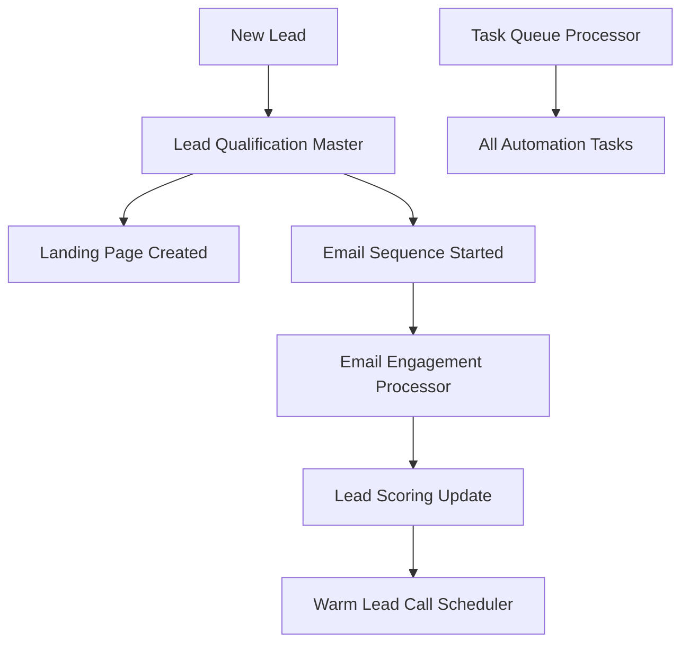

# LeadFly AI - n8n Workflow Collection

This directory contains n8n workflows that orchestrate the LeadFly AI automation system at scale.

## 🚀 Available Workflows

### 1. **Lead Qualification Master** (`lead-qualification-master.json`)
**Purpose**: Main workflow that processes new leads through the complete qualification funnel

**Triggers**: Webhook (`/leadfly/webhook/new-lead`)
**Features**:
- Validates and processes incoming lead data
- Initiates lead qualification through API
- Starts email sequences and landing page creation
- Schedules follow-up scoring tasks
- Handles errors with proper notifications

**Webhook URL**: `https://your-n8n-instance.com/webhook/leadfly/webhook/new-lead`

### 2. **Email Engagement Processor** (`email-engagement-processor.json`)
**Purpose**: Processes email engagement events from multiple providers

**Triggers**: Webhook (`/leadfly/webhook/email-engagement`)
**Features**:
- Multi-provider webhook support (SendGrid, Mailgun, Postmark, SES)
- Real-time engagement processing
- Automatic lead scoring updates
- High-value engagement detection
- Warm lead qualification triggers

**Webhook URL**: `https://your-n8n-instance.com/webhook/leadfly/webhook/email-engagement`

### 3. **Warm Lead Call Scheduler** (`warm-lead-call-scheduler.json`)
**Purpose**: Automated scheduling of TCPA-compliant warm lead calls

**Triggers**: Schedule (Every 15 minutes)
**Features**:
- Automatic warm lead detection
- TCPA-compliant call scheduling
- Priority-based scheduling (high/medium)
- Overdue call monitoring
- Multi-channel notifications

### 4. **Task Queue Processor** (`task-queue-processor.json`)
**Purpose**: Centralized processing of scheduled automation tasks

**Triggers**: Schedule (Every 5 minutes + Every 6 hours for cleanup)
**Features**:
- Batch task processing (50 tasks per run)
- Error handling and retry logic
- Task statistics and health monitoring
- Automated cleanup of completed tasks
- Performance alerts and notifications

## 📋 Setup Instructions

### 1. **Import Workflows**
1. Open your n8n instance
2. Go to **Workflows** → **Import from File**
3. Import each JSON file individually
4. Activate the workflows after configuration

### 2. **Environment Variables**
Configure these environment variables in n8n:

```bash
LEADFLY_API_URL=https://your-leadfly-domain.com
LEADFLY_API_KEY=your-secure-api-key
NODE_ENV=production
```

### 3. **Credentials Setup**
Create these credentials in n8n:

#### **LeadFly API Auth** (HTTP Header Auth)
- **Name**: `leadfly-api-auth`
- **Header Name**: `Authorization`
- **Header Value**: `Bearer {{$env.LEADFLY_API_KEY}}`

### 4. **Webhook Configuration**
Configure your email providers to send webhooks to:

#### **SendGrid**
```
Webhook URL: https://your-n8n-instance.com/webhook/leadfly/webhook/email-engagement
Events: delivered, open, click, bounce, unsubscribe, spamreport
HTTP Method: POST
```

#### **Mailgun**
```
Webhook URL: https://your-n8n-instance.com/webhook/leadfly/webhook/email-engagement
Events: delivered, opened, clicked, unsubscribed, complained, bounced
```

#### **Postmark**
```
Webhook URL: https://your-n8n-instance.com/webhook/leadfly/webhook/email-engagement
Events: Delivery, Open, Click, Bounce, SpamComplaint, Unsubscribe
```

### 5. **Lead Input Integration**
Send new leads to the qualification webhook:

```bash
curl -X POST https://your-n8n-instance.com/webhook/leadfly/webhook/new-lead \
  -H "Content-Type: application/json" \
  -d '{
    "user_id": "user_123",
    "first_name": "John",
    "last_name": "Doe", 
    "email": "john@company.com",
    "company": "Acme Corp",
    "title": "VP Sales",
    "phone": "+1234567890",
    "industry": "technology",
    "source": "apollo",
    "campaign_id": "camp_456"
  }'
```

## 🔄 Workflow Dependencies

The workflows work together in this sequence:



## 📊 Monitoring & Alerts

The workflows include comprehensive monitoring:

### **Success Metrics**
- Task processing success rate (target: >95%)
- Lead qualification rate
- Email engagement rates
- Call scheduling efficiency

### **Alert Conditions**
- Task processing failures >10%
- Overdue tasks >10 items
- High-priority engagement events
- System performance issues

### **Notification Channels**
Configure these in the "Send Notifications" nodes:
- Slack webhooks
- Email alerts
- SMS notifications (Twilio)
- PagerDuty integration

## 🛠️ Customization

### **Scaling Configuration**
Adjust batch sizes in workflows:
- Task processor: 50 tasks per batch (recommended)
- Email processor: Process all events immediately
- Call scheduler: Check every 15 minutes

### **Timing Adjustments**
Modify cron expressions:
- Task processor: `0 */5 * * * *` (every 5 minutes)
- Call scheduler: `0 */15 * * * *` (every 15 minutes)
- Cleanup: `0 0 */6 * * *` (every 6 hours)

### **Error Handling**
Each workflow includes:
- Retry logic for failed tasks
- Error logging and notifications
- Graceful degradation
- Health checks

## 🔒 Security Notes

- All API calls use Bearer token authentication
- Webhook signatures are verified
- Sensitive data is not logged
- Rate limiting should be configured at infrastructure level

## 📈 Performance Optimization

For high-volume usage:
1. **Horizontal Scaling**: Run multiple n8n instances
2. **Database Optimization**: Use Redis for task queuing
3. **Webhook Batching**: Group events where possible
4. **Monitoring**: Set up detailed performance metrics

## 🚨 Troubleshooting

### **Common Issues**
1. **Webhook timeouts**: Increase timeout values in HTTP Request nodes
2. **Rate limiting**: Add delay nodes between API calls
3. **Memory issues**: Reduce batch sizes or increase n8n memory
4. **Authentication errors**: Verify API keys and credentials

### **Debug Mode**
Enable debug mode in n8n settings to see detailed execution logs.

### **Health Checks**
Use the task processor's health check endpoint:
```bash
curl https://your-leadfly-domain.com/api/automation/task-processor?action=health_check
```

---

**Next Steps**: After importing and configuring these workflows, your LeadFly AI system will have complete automation orchestration with real-time processing, intelligent qualification, and comprehensive monitoring.